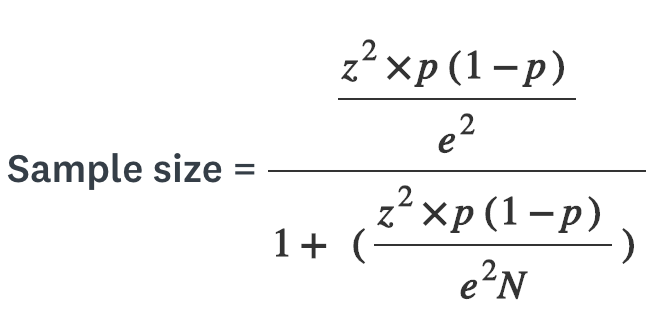

# MiniProject2

## Simple random sampling
The best way to describe simple random sampling is a subset of a statistical population in which each member of the subset has an equal probability of being chosen.  A simple random sampe is meant to be an unbiased representation of a group.

Example would be 25 employees chosen out of 250 employees out of a hat. The sample is random because each employee has a chance of being chosen.

## How we use random sampling
`def sample_method`

## Systematic sampling
Systematic sampling is a type of probability sample method in which sample members from a large population are selected according to a random starting point but with a fixed, periodic interval. Example would be in a population of 100,000 people a system selects every 1000 person at certain intervals.

## Margin of Error
Margin of error tells you how many percentage points your results will differ from the population value. 95% confidence interval with a 4 percent margin of error means that your statistic will be wtihin 4 percentage points of the real population value 95% of the time.  It will gave you the range of values below and above a sample statistic in a confidence interval.  

## Confidence Interval 
Confidence interval is the way to show what the uncertainty is with a certain statistic (from a sample or survey).  It will show the probability that a population parameter fall between two set values for a certain proportion of times. Confidence intervals measure the degree of uncertainity or certainity in a sampling method. A confidence interval can take any number of probabilities, with the most common being 95% or 99% confidence level.

## How To Find Confidence Interval
For our calculator we used `def confidenceinterval` 

## Cochran's Sample Size Formula
Cochran formula allows you to calculate an ideal sample size given a desired level of precision, desires confidence level, and the estimated proportion of the attribute present in the population. Apporpriate for situations with large populations. A sampe size provides more information about a samller population than a large one, so there's a 'correction' through which the number given by Cochran's formula can be reduced if the whole population is small.

**Where:**

e is the desired level of precision (i.e. the margin of error),
p is the (estimated) proportion of the population which has the attribute in question,
q is 1 – p.
The z-value is found in a Z table.

## How to find the right sample size
Calculating the right sample size is crucial to gaining accurate information! In fact, your survey’s confidence level and margin of error almost solely depends on the number of responses you received.

`Sample Size = (Distribution of 50%) / ((Margin of Error% / Confidence Level Score)Squared)`

## How to find a sample size given a confidence Interval and Width (unkown population standard deviation):
**Population size:** The total number of people in the group you are trying to study. If you were taking a random sample of people across the U.S., then your population size would be about 317 million. Similarly, if you are surveying your company, the size of the population is the total number of employees.

**Margin of error:** A percentage that tells you how much you can expect your survey results to reflect the views of the overall population. The smaller the margin of error, the closer you are to having the exact answer at a given confidence level.

**Sampling confidence level:** A percentage that reveals how confident you can be that the population would select an answer within a certain range. For example, a 95% confidence level means that you can be 95% certain the results lie between x and y numbers.

## How to find sample size given a Confidence Interval and Width (known population standard deviation)

`Necessary Sample Size = (Z-score)2 * StdDev*(1-StdDev) / (margin of error)2`

## Sources
* [Google] (https://www.Google.com)
* [Investopedia] (https://investopedia.com)
* [Wikipedia] (https://www.wikipedia.org)
* [Youtube] (https://www.youtube.com)

